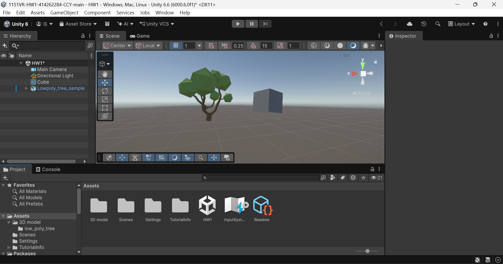

# 1151VR-HW1-414262284-張智瑜

## 專案說明

本次作業使用 Unity 建立 3D 專案，依照課堂所教的操作方式，練習場景中物件的移動、旋轉與縮放等基本功能，並自行選擇一個 Low Poly Tree 3D 模型匯入 Unity 專案中。將模型拖曳至 Scene 後，透過 Hierarchy 選取物件，並在 Inspector 中調整 Transform 的 Position、Rotation 與 Scale，使模型放置在適當的位置。完成場景設定後執行專案確認模型能正常顯示，最後儲存 Unity 專案並上傳至 GitHub，同時錄製操作過程並上傳至 YouTube。

## 專案截圖

## YouTube 連結

https://youtu.be/shpaZjp6E7U

## GitHub 連結

https://github.com/cychang1688-sketch/1151VR-HW1-414262284-CCY.git
